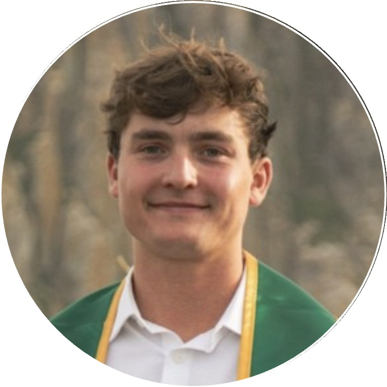

# ECHOES Beta: Frequently Asked Questions

Plain answers to the questions historical societies, museums, and libraries ask most.

---

**What exactly is ECHOES?**
An interactive experience where the public can "talk" with a historical figure, starting
with **Myron Angel**, the father of Cal Poly and historian of San Luis Obispo County. Users
ask questions and receive answers in the figure's voice, drawn strictly from real,
validated historical sources.

**Isn't AI known for making things up?**
Yes, and that's the exact problem ECHOES is built to solve. Myron answers **only from a
curated set of validated sources** (primary documents, his own 1883 *History of San Luis
Obispo County*, and other public-domain material), **not the open internet**. Every answer
is **labeled by evidence:** Documented, Reasonable inference, Contested, or Not in the
sources, and users can tap **"Show evidence"** to see the actual citations. When the
sources don't support an answer, it says so rather than guessing.

**How accurate is it really?**
It's good, and getting better, but it is not perfect, which is the honest reason we're in
**beta** and the reason **your expertise matters**. Your feedback on what's accurate, what's
missing, and what's framed poorly is the single most valuable thing a partner provides.

**What does it cost us?**
During the beta there is **no licensing fee.** You cover only the **AI usage cost**, which
is small, typically **a fraction of a cent per conversation.** Even steady public use
usually comes to **just a few dollars a month.** We pass this through **at cost with no
markup,** and we can set a **monthly spending cap** so there are never surprises.

**What do we have to do?**
Very little: **try it, and tell us what you think.** Optionally, share source suggestions,
photographs, topics, or ideas for future figures from your collection. There's no minimum
time commitment, and you can step back anytime.

**Do we need to install anything or involve IT?**
No. ECHOES is a **web link and a QR code**, with nothing to install, no integration, and no
accounts for the public. You could place a QR code beside an exhibit, add a link to your
website, or simply use it internally.

**Who owns our materials and content?**
We use **only public-domain, your-own, or explicitly permissioned** material, and **you
approve anything drawn from your collection before it goes live.** You retain all your
rights; participating in the beta doesn't transfer ownership of anything.

**Is it appropriate for students and the public?**
Yes. It's designed for middle- and high-school readers and the general public, with
safeguards around sensitive topics. Difficult history is handled with honesty and context.

**What about visitor privacy?**
The public uses it **without creating accounts.** We keep data minimal and can tailor
retention to your organization's needs.

**What's the long-term vision?**
Today Myron is a **text-and-voice** conversation. The roadmap leads to a **living portrait,**
a "moving picture frame" of Myron you speak with face to face. Beta partners help us get
there and help choose which San Luis Obispo stories come next.

**Why are you doing this?**
Two reasons, stated plainly: **to promote history learning in San Luis Obispo**, and **to
continue my own research into how conversational AI can be made accurate, sourced, and
genuinely educational.** Partnering with the county's history keepers serves both.

**What's the catch?**
There isn't a hidden one. The beta is free to use, you pay only small at-cost AI usage, and
you can leave whenever you like. In exchange, your feedback helps build something that
serves San Luis Obispo's history.

---

**Questions? Want a demo?**

<table>
  <tr>
    <td style="vertical-align: middle; padding-right: 16px;">
      
    </td>
    <td style="vertical-align: middle;">
      <strong>Matthew Kennedy · ECHOES</strong> 
      Cal Poly MSBA alumnus & six-year SLO resident 
      📧 matthewkennedy22@gmail.com · 📞 (925) 285-2090
    </td>
  </tr>
</table>
