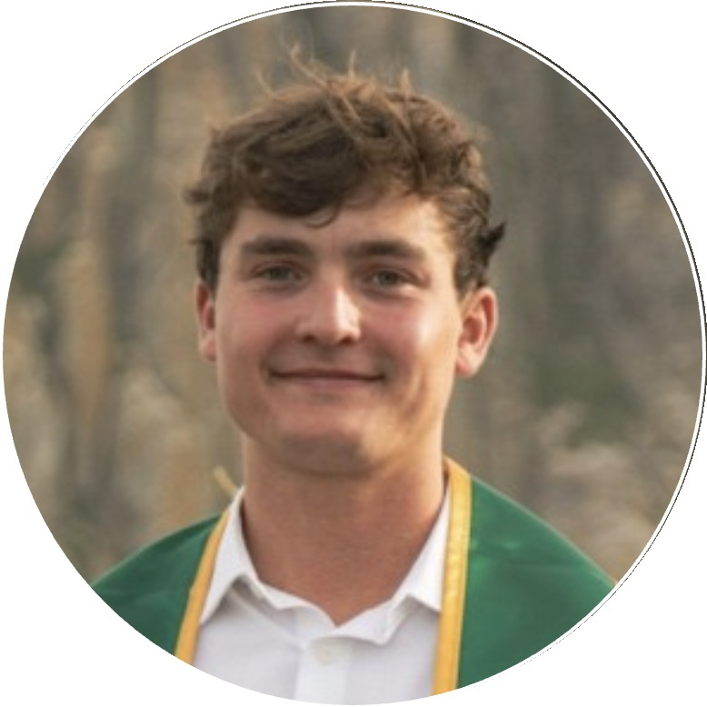

<table>
  <tr>
    <td style="vertical-align: middle; padding-right: 16px;">
      
    </td>
    <td style="vertical-align: middle;">
      <strong>Matthew Kennedy</strong> 
      ECHOES: Local history, made conversational 
      matthewkennedy22@gmail.com · (925) 285-2090 
      San Luis Obispo, California
    </td>
  </tr>
</table>

---

**Subject:** Inviting your organization to try ECHOES — and, if useful, a custom historical figure

Dear [Name / Director],

My name is **Matthew Kennedy**, a Cal Poly MSBA alumnus and San Luis Obispo resident. I’m building **ECHOES**, a source-grounded way for people to converse with figures from California history. Answers come from curated public-domain sources and primary texts, with evidence labels and citations. When the record is incomplete, the figure says so.

The live beta is called **California Speaks** and already includes seven figures from Tahoe to San Diego (Twain, Bancroft, Hemme, Myron Angel, Mason, Anita Loos, Horton). Visitors open a link or scan a QR code—no app, no account, no IT project.

I’m reaching out because I’d like partners who already steward local history: museums, historical societies, archives, libraries, and educators. During the beta, access is free for your organization and visitors. If it’s a fit, I can also build a **custom figure for your town, region, or exhibit** as a collaborative pilot, using sources you recommend.

I’ve enclosed a short partner overview. You can try the live beta now:

**https://echoes-inky-zeta.vercel.app/**

Could I give you a **15-minute live demo**, in person, by phone, or video, at a time that works for you? No commitment on first contact—just a look, honest feedback, and a conversation if it feels useful.

Thank you for everything you do to preserve and share history. I’d be glad to build alongside you.

Warm regards,

**Matthew Kennedy**  
ECHOES  
matthewkennedy22@gmail.com · (925) 285-2090
